# GNN-Related-Papers
This is a project to collect and share papers about GNN. Papers can be systematic or algorithmic. As long as you feel fruitful, you can share them with us!
# Content
- <a href = "#GNN System Paper">GNN System Paper</a>
  - <a href = "#Single Machine System">Single Machine System</a>
  - <a href = "#Distributed GNN System">Distributed GNN System</a>
  - <a href = "#Accelerator">Accelerator</a>
- <a href = "#GNN Algorithmic Paper">GNN Algorithmic Paper</a>

# [GNN System Paper](#content)
## [Single Machine System](#content)
| Reference                       | System | Description                                                  | Architecture                            |
| :-----------------------------: | :----- | ------------------------------------------------------------ | --------------------------------------- |
| <a href = "https://arxiv.org/pdf/1903.02428.pdf">[1]</a> | PyG(2019)     | <ul><li>GNN update abstract representation</li><li>sparse GPU acceleration, dedicated CUDA kernels, efficient mini-batch</li><li>support both CPU and GPU computations</li></ul> | 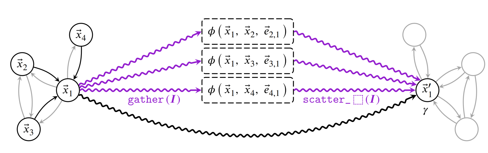 |
| <a href = "https://arxiv.org/pdf/1909.01315.pdf">[2]</a> | DGL (2019)    | <ul><li>provides user-configurable message-passing primitives</li><li>makes graph the central programming abstraction</li> | 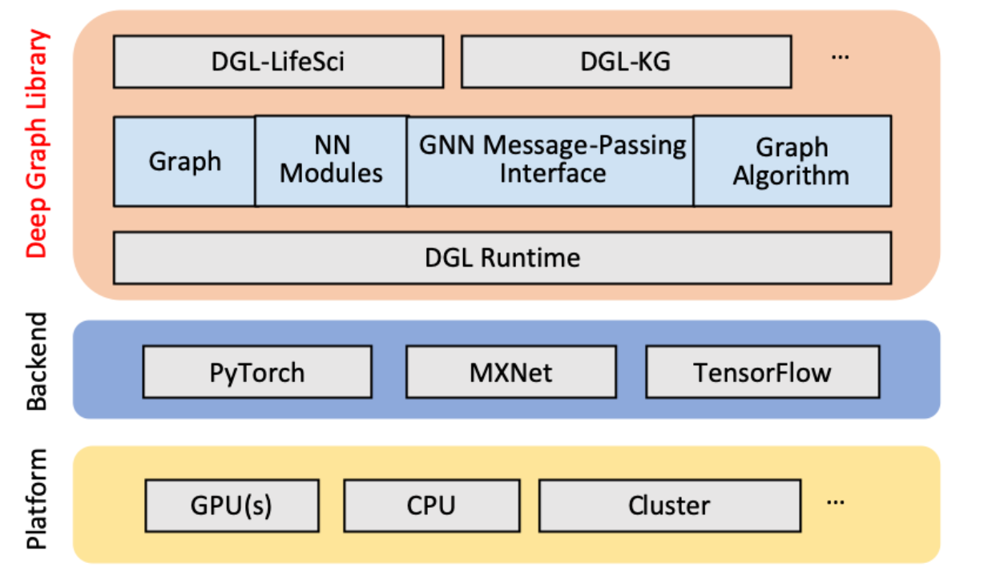 |
| <a href = "https://www.usenix.org/system/files/atc19-ma_0.pdf">[3]</a> | NeuGraph (2019) | <ul><li>bridges the graph and dataflow models</li><li>proposes a new programming model called SAGA-NN (Scatter-ApplyEdge-Gather-ApplyVertex with Neural Networks)</li> | 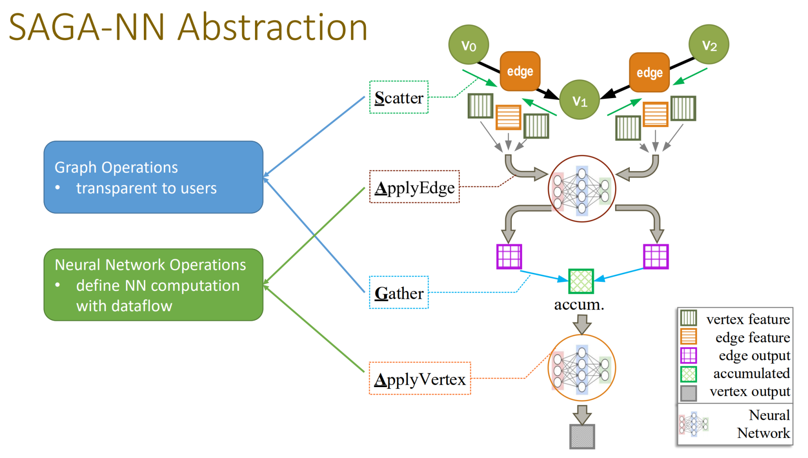 |

## [Distributed GNN System](#content)
| Reference                       | System | Description                                                  | Architecture                            |
| :-----------------------------: | :----- | ------------------------------------------------------------ | --------------------------------------- |
| <a href = "http://www.vldb.org/pvldb/vol12/p2094-zhu.pdf">[1]</a> | AliGraph(2019)     | <ul><li>the caching strategy: caching neighbors of some important vertices</li><li>abstract three kinds of different samplers: TRAVERSE、 NEIGHBORHOOD、 NEGATIVE</li></ul> | 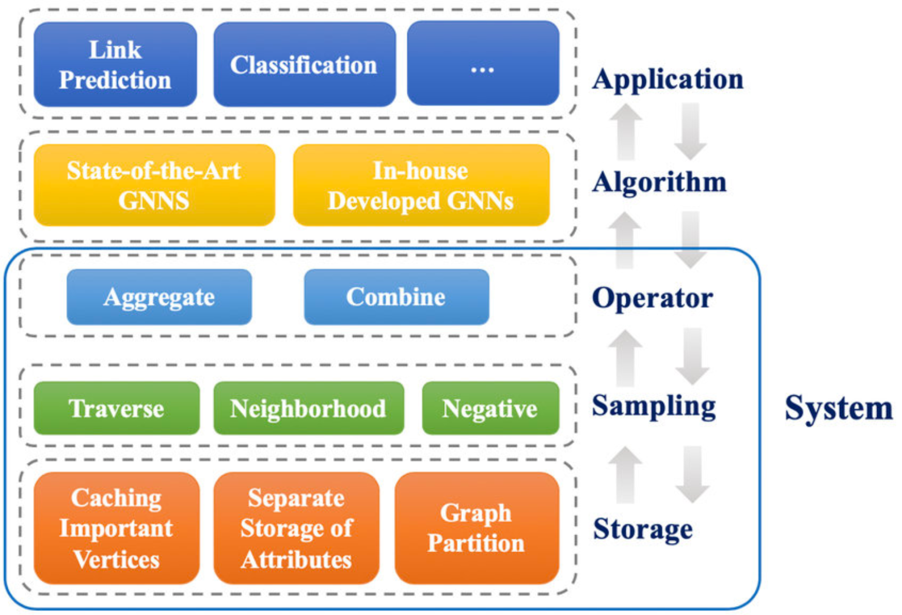 |
| <a href = "https://github.com/alibaba/euler/wiki/System-Introduction">[2]</a> | Euler(2019)    | <ul><li>layered abstraction and flexible extensity</li><li>heterogeneous graph embedding</li></ul> | 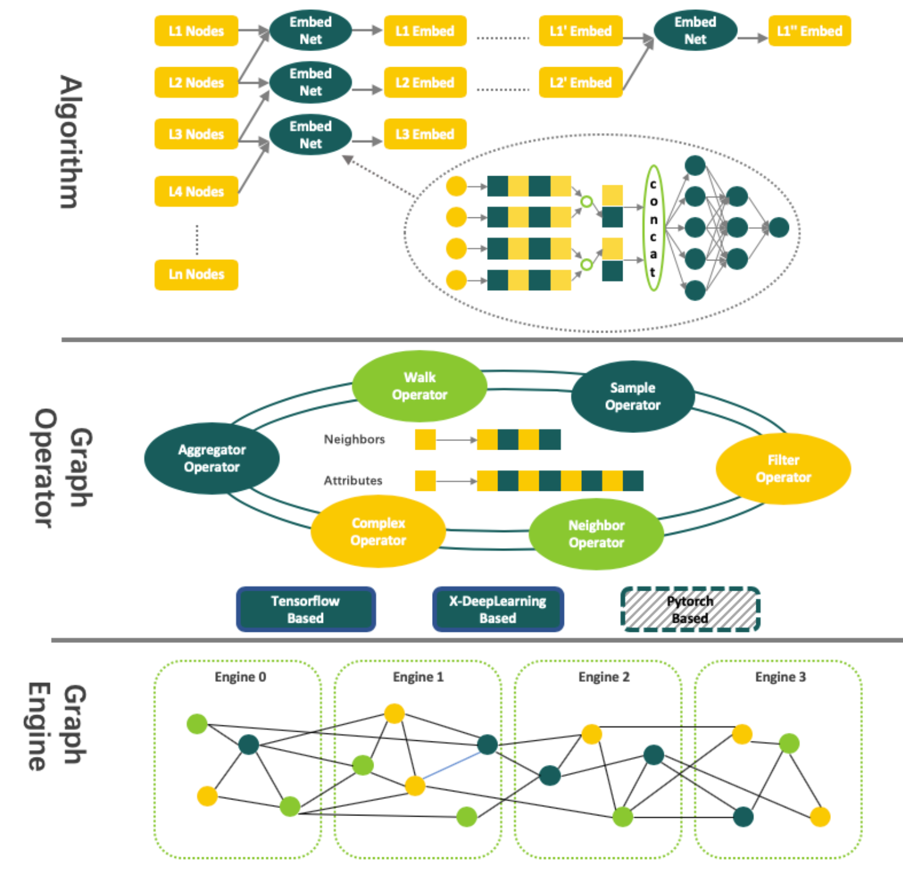 |
| <a href = "http://www.vldb.org/pvldb/vol13/p3125-zhang.pdf">[3]</a> |  AGL(2020)    | <ul><li>constructs K-hop neighborhood for each node</li><li>abstracts all the message passing schemes in training and inference, and implement them simply using MapReduce</li></ul> | 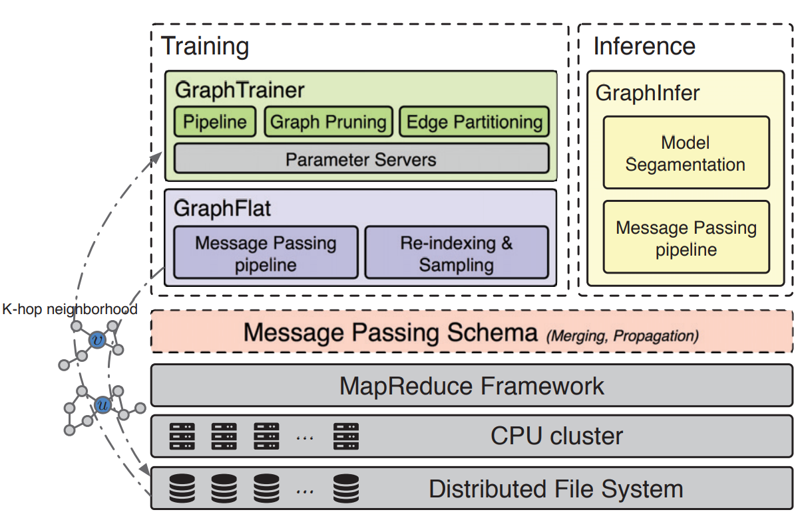 |
| <a href = "https://proceedings.mlsys.org/paper/2020/file/fe9fc289c3ff0af142b6d3bead98a923-Paper.pdf">[4]</a> |  ROC(2020)    | <ul><li>a novel online linear regression model to achieve efficient graph partitioning</li><li>a dynamic programming algorithm to minimize data transfer cost</li></ul> | 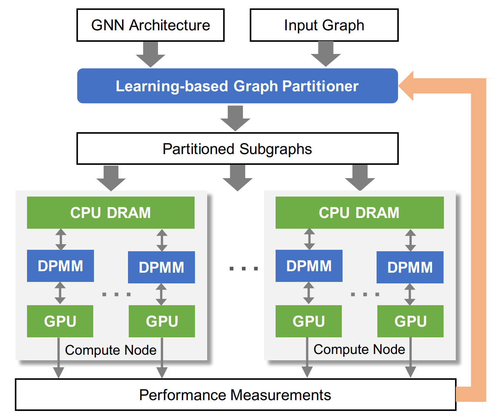 |
| <a href = "https://arxiv.org/pdf/2010.05337.pdf">[5]</a> |  DistDGL(2020)    | <ul><li>adopts METIS to partition a graph</li><li>replicates halo nodes</li></ul> | 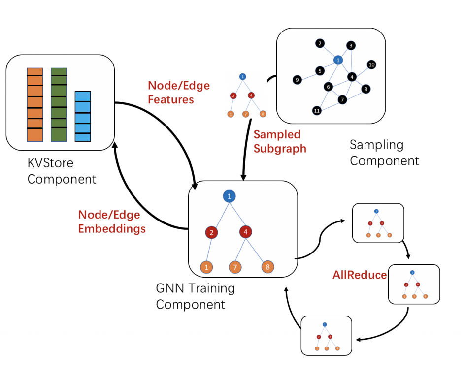 |
| <a href = "https://arxiv.org/pdf/2104.06700.pdf">[6]</a> |  DistGNN(2021)    | <ul><li>a highly architecture-optimized implementation for single socket CPUs</li><li>a minimum vertex-cut graph partitioning algorithm</li><li>a family of delayed update algorithms</li></ul> | 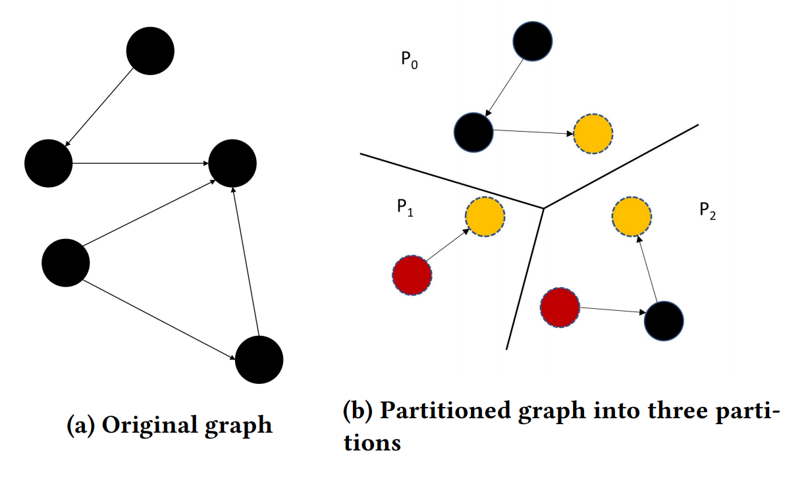 |
| <a href = "https://dl.acm.org/doi/pdf/10.1145/3447786.3456233">[7]</a> |  DGCL(2021)    | <ul><li>SPST algorithm for communication planning</li></ul> |  |
| <a href = "https://www.usenix.org/system/files/osdi21-thorpe.pdf">[8]</a> |  Dorylus(2021)    | <ul><li>divides a training pipeline into a set of fine-grained tasks</li><li>performs a unique form of bounded asynchronous training</li></ul> | 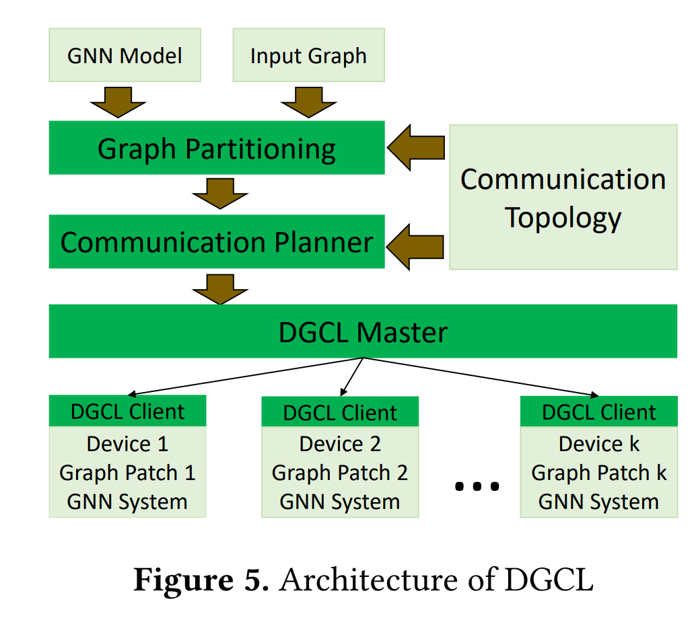 |
| <a href = "https://www.usenix.org/system/files/osdi21-gandhi.pdf">[9]</a> |  P3(2021)    | <ul><li>proposes a push-pull parallelism based execution strategy that combines intra-layer model parallelism with data parallelism</li></ul> | 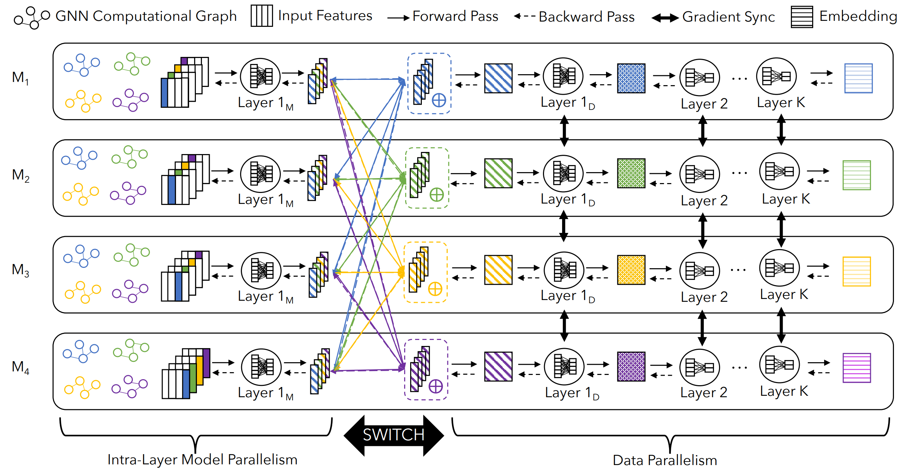 |

# [GNN Algorithmic Paper](#content)
| Reference                       | Modules | Description                                                  | Architecture                            |
| :-----------------------------: | ------- | ------------------------------------------------------------ | --------------------------------------- |
| <a href = "https://openreview.net/pdf?id=SJU4ayYgl">[1]</a> | GCN     |  |  |
